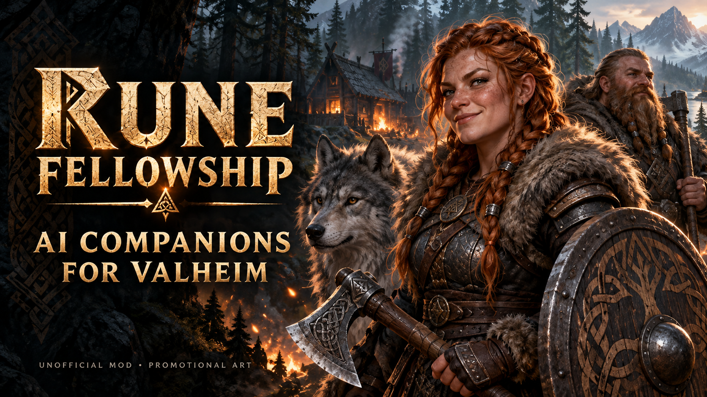
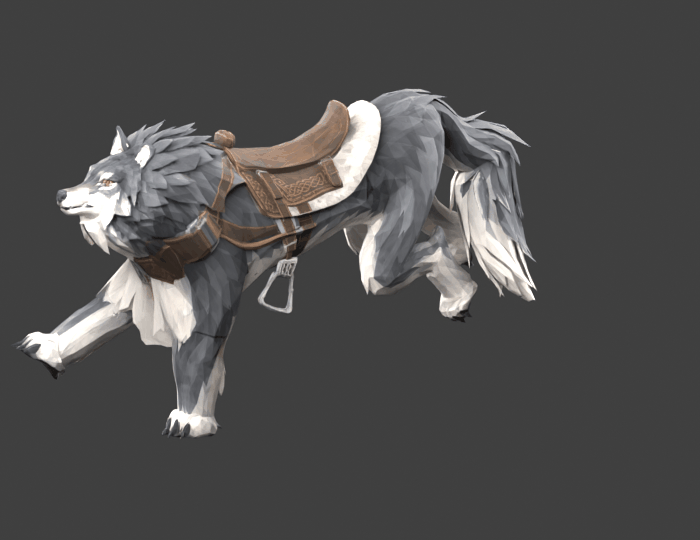
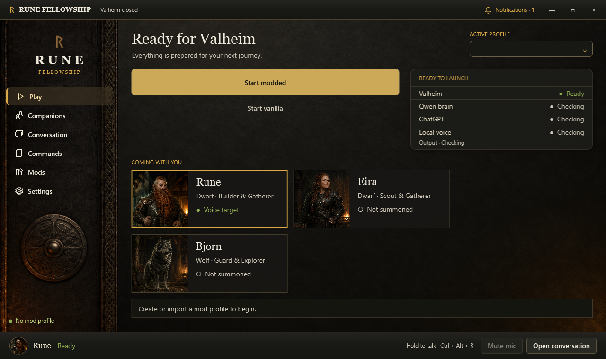
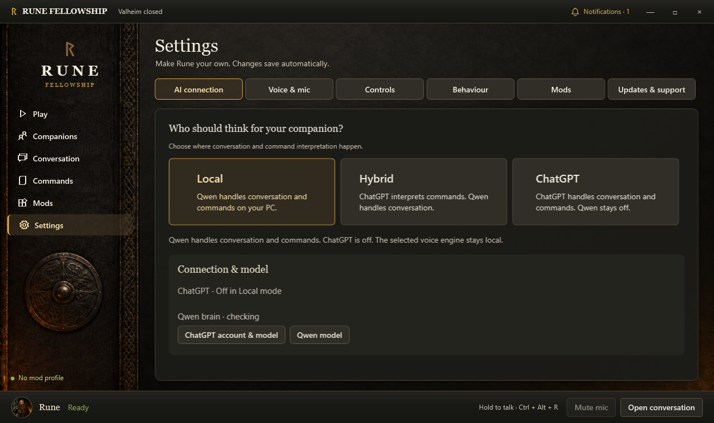
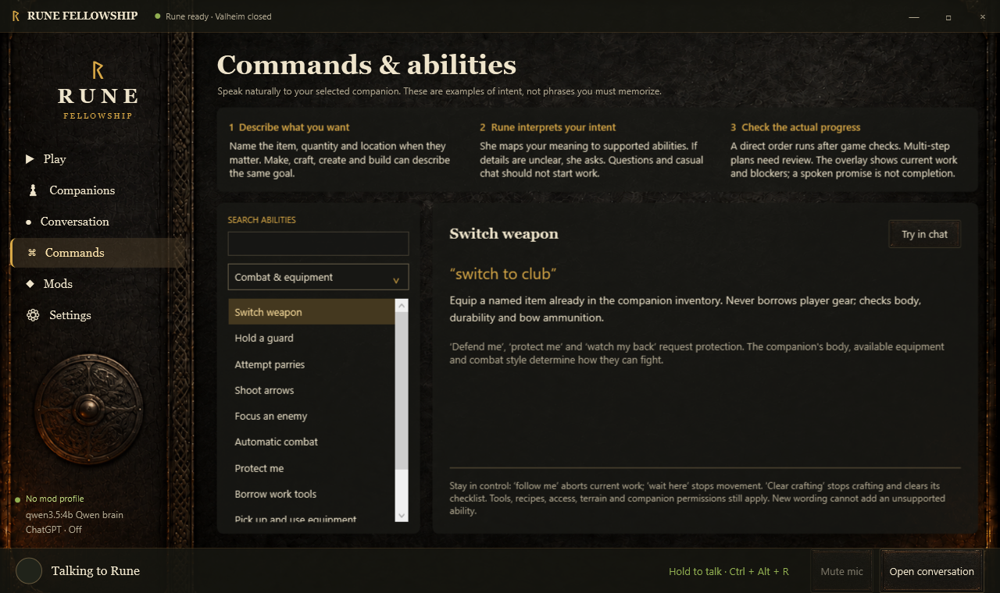

# Rune Fellowship

> **Standalone plugin 0.4.43 beta:** F6 supplies basic companion setup, summoning and orders without the desktop app. F8 remains the information overview. This package contains no desktop installer. Fresh-world summoning, orders, mounted idle and save/reload passed isolated background native checks. Physical keyboard input and rendered UI layout remain unverified. Thunderstore approved the corrected standalone 0.4.43 package on 12 September 2026. The optional desktop release remains 0.4.41 beta. See [setup instructions and validation limits](docs/THUNDERSTORE-LISTING.md).




## Want voice and AI conversations? Download the Rune desktop app

The Rune desktop app is a **separate download from GitHub**. It is not included when you install this mod through Thunderstore.

**[Download the optional Rune desktop app from GitHub](https://github.com/rokley-hub/RuneFellowship/releases/tag/v0.4.41-beta)**

On that release page, open **Assets** and choose **Rune-Online-Installer-0.4.41-beta.zip** for a first installation. The source and update ZIPs are different downloads.

Without the app, you can still press **F6** to summon and control companions, fight alongside them and ride your direwolf.

An unofficial Windows app and Valheim companion mod with local speech, natural-language orders, companion profiles, mod management and an in-game task overview.

**Windows beta: desktop 0.4.41 / game plugin 0.3.26.** Download **Rune-Online-Installer-0.4.41-beta.zip** from [the desktop release on GitHub](https://github.com/rokley-hub/RuneFellowship/releases/tag/v0.4.41-beta). Matching source is available on the same release page. Extract the whole installer ZIP and run `Install Rune.exe`. Setup downloads selected runtimes and models from their original sources. This beta is unsigned and has been tested on the development PC; see the setup guide, privacy description and known limitations in `docs`. The app does not include Valheim or other authors' game mods. Donations are voluntary and do not unlock features. Rune is not affiliated with Iron Gate, Coffee Stain or OpenAI.

## Install and play

Use the packaged Rune app; you do not need to compile this source or arrange DLL files yourself. Install Valheim through Steam using your own license, then:

1. Open Rune's **Mods** page, locate Valheim if needed, and create or select a Rune-owned profile.
2. A new profile downloads the required modding packages from their original publishers. For an existing profile, click **Profile options → Set up required mods**.
3. Use **Browse mods** for additional mods; Nexus downloads and version checks use its website.
4. Set up your microphone, voice and companions, then use **Start modded**. Click a companion card on Play to choose who receives your voice input.

**Building compatibility remains a beta limitation.** An older integration caused repeated player spawning; keep an incompatible integration disabled. The newer integration has not passed a successful construction test. Requirement setup can enable the integration, so review your profile before launching. Rune does not contain a fix for third-party mod code.

Internet access is needed to download missing requirements. Rune shows download/install progress. If setup fails, the profile is kept and **Profile options → Set up required mods** retries it. Close Valheim before changing mods. See [the player setup guide](docs/START-HERE.md) for the app and optional voice/model packs.

The build instructions below are **for developers changing Rune's source**, not player installation steps.

## Components

- `src/Voice`: .NET 8 WPF desktop with shared gameplay command rules.
- `src/Mod`: Valheim/BepInEx game executor; language models cannot invent unsupported actions.
- `assets/Direwolf`: generated direwolf mesh, texture and riding icon embedded in the game plugin.
- `src/Shared`: protocol, capability catalogue and combat policy.
- `audio`: loopback speech recognition and voice services.
- `blueprint-library` and `tools`: original shelter definitions and their generator/checker.
- `tests`: deterministic protocol/game-policy tests; native gameplay validation additionally requires an isolated game world.
- `packaging`: release staging, allowlisted source export, integrity checks, installer and rollback tooling.

ChatGPT mode uses the user's own account through the official user-installed helper. Local mode uses Qwen. All microphone recognition and companion speech remain local. Consult `docs/PRIVACY.md` before enabling cloud dialogue.

## Developer build: desktop and tests

Install a .NET 8 SDK on Windows, then run from this source folder:

```
dotnet restore src/Voice/RuneVoice.csproj --configfile NuGet.Config
dotnet publish src/Voice/RuneVoice.csproj -c Release -o build/desktop
dotnet run --project tests/RuneTests.csproj
```

## Developer build: game plugin

Compiling the plugin requires reference assemblies from your own licensed Valheim installation and the original BepInExPack_Valheim and Jotunn packages. Rune can download and install those packages for normal play as described above. This source project's build expects a separate reference folder containing `BepInExPack/BepInExPack_Valheim/BepInEx/core/BepInEx.dll`, `0Harmony.dll` beside it, and `Jotunn/plugins/Jotunn.dll`. Arrange that folder only if you are building the plugin yourself; the app's installed profile layout is different.

```
dotnet build src/Mod/RuneCompanion.csproj -c Release -p:ValheimDir="YOUR_VALHEIM_FOLDER" -p:DependencyDir="YOUR_DEPENDENCY_FOLDER/"
```

No game assemblies or third-party mod binaries are stored in this source export. Tests must use new worlds/characters and may not run against important saves.

## License

Rune's original source is GPLv3-only with the additional permission in `LINKING-EXCEPTION.md` for Valheim/Unity and the listed modding components. See `LICENSE`. Third-party software, models and assets retain their own terms. This source release does not grant rights to redistribute the Valheim game.

Packaging scripts currently expect the developer staging layout documented in `packaging/BUILDING-RELEASE.md`; runtime binaries and model packs are separate inputs. A source checkout alone does not contain multi-gigabyte models.

## Latest update

0.4.41 adds the custom saddled direwolf, riding and combat controls, corrected mount rendering and saddle attachment, a cleaner fellowship display and a useful F8 companion overview. Read [the expanded player guide](docs/PLAYER-GUIDE.md) for riding, food, equipment, tracking and troubleshooting. See [CHANGELOG.md](CHANGELOG.md) for installation and beta limitations.

## Direwolf in motion



Looping Blender preview of the custom saddled direwolf's run cycle. Captured during development; in-game lighting and the latest body proportions differ. This shows the model animation, not a live gameplay recording.

## Inside the desktop app

Actual Rune interface captures with example companions. Play and Settings are from desktop 0.4.29; Commands is an earlier 0.4.25 capture. Some controls have since changed.

### Play and companion selection



Choose who receives your voice and typed orders. Companion cards show the fellowship, while notifications highlight updates and setup issues.

### AI and voice settings



Choose Local, Hybrid or ChatGPT for conversation and commands. Speech recognition and companion voices stay local.

### Commands and abilities



Browse supported intentions, examples and their requirements. Available actions depend on the companion's body, equipment and surroundings.
